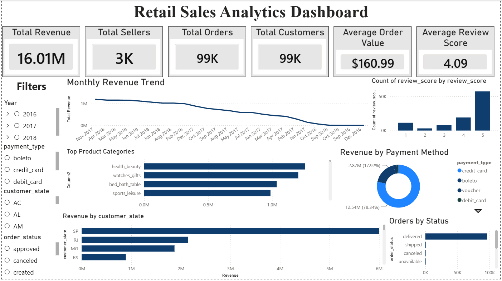
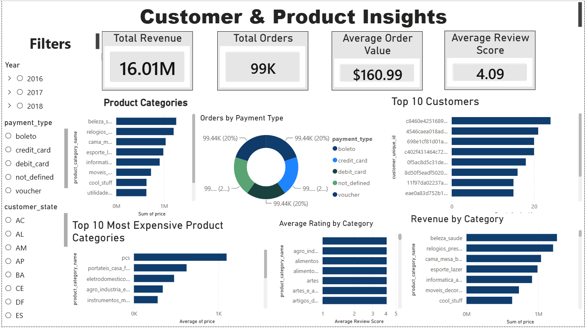
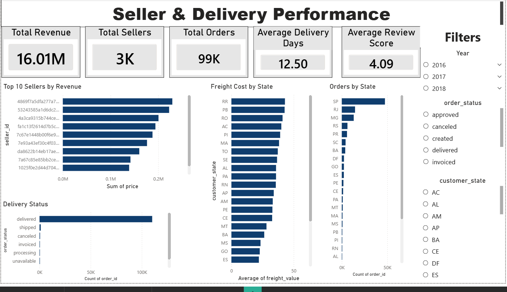

# 📊 Retail Sales Analytics Dashboard

> Interactive Business Intelligence Dashboard built using **Power BI, SQL, DAX, and MySQL** to analyze over **100,000+ retail transactions**.

---

## 📸 Dashboard Preview

> **(Replace this after creating the collage image)**


---

# 📌 Project Overview

This project analyzes an e-commerce retail dataset using SQL and Power BI to uncover business insights related to sales performance, customer behavior, seller performance, product trends, and payment methods.

The dashboard enables decision-makers to monitor key business metrics through interactive visualizations and KPIs.

---

# 🎯 Business Objectives

- Analyze overall revenue performance
- Monitor monthly sales trends
- Identify top-selling product categories
- Evaluate seller performance
- Analyze customer purchasing behavior
- Understand payment preferences
- Monitor delivery and review performance

---

# 🛠 Tech Stack

| Technology | Usage |
|------------|-------|
| Power BI | Dashboard Development |
| SQL (MySQL) | Data Analysis |
| DAX | Business Measures |
| Power Query | Data Cleaning |
| Git & GitHub | Version Control |

---

# 📊 Dashboard Pages

## 1️⃣ Executive Dashboard

Features:

- Total Revenue
- Total Orders
- Total Customers
- Total Sellers
- Average Order Value
- Average Review Score
- Revenue Trend
- Revenue by State
- Revenue by Payment Method
- Orders by Status



---

## 2️⃣ Customer & Product Insights

Features:

- Product Category Analysis
- Revenue by Category
- Average Product Price
- Customer Distribution
- Payment Analysis



---

## 3️⃣ Seller & Delivery Performance

Features:

- Top Sellers
- Delivery Performance
- Freight Analysis
- Order Status
- Seller Revenue



---

# 📂 Project Structure

```text
Retail-Sales-Analytics-Dashboard
│
├── Data
├── SQL
├── PowerBI
├── Documentation
├── Images
├── README.md
└── LICENSE
```

---

# 📈 Key Business Insights

- Credit Cards are the most preferred payment method.
- Revenue is concentrated among a few product categories.
- Customer ratings remain consistently high.
- Revenue varies significantly across states.
- A small percentage of sellers contribute a major share of revenue.

---

# 🚀 Skills Demonstrated

- SQL Queries
- Joins
- Aggregate Functions
- Window Functions
- Data Cleaning
- Data Modeling
- DAX Measures
- Power BI Dashboard Design
- Business Intelligence
- Data Visualization

---

# 👨‍💻 Author

**Vivek Junare**

Computer Science Engineering (Data Science) Student

Aspiring Data Analyst

GitHub:
https://github.com/VivekJunare00

---

⭐ If you found this project helpful, consider giving it a star!